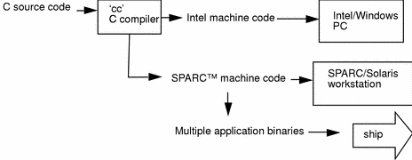

# Java overview
## Must have to read

- [Introduction to Java](https://www.geeksforgeeks.org/introduction-to-java/#:~:text=Java%20is%20a%20class%2Dbased,all%20platforms%20that%20support%20Java. "Introduction to Java")
- [Overview of Java](https://docs.oracle.com/en/database/oracle/oracle-database/12.2/jjdev/Java-overview.html "Overview of Java")
- [Java Latest Versions and Features](https://howtodoinjava.com/java-version-wise-features-history/ "Java Latest Versions and Features")

## The main features of the Java language
Java is an object-oriented programming language developed by Sun Microsystems in 1995. This language was originally called Oak and was developed for consumer devices, but in the course of development, it became used in web applications due to its security and cross-platform. Java is actively supported and as of today, it is already version 18.

### Main Features of Java:
- Object-oriented programming.
- Simplicity.
- Security. Can't access memory directly.
- Cross-platform. Can be run on any platform where the JRE is installed.
- Automatic garbage collection. The memory does not need to be explicitly cleared.

**As Java has evolved, many features have been added. Some of them:**

Java 5:
- Generics
- Annotations
- Autoboxing/unboxing
- Enumerations
- Varargs
- Enhanced for each loop
- Static imports
- New concurrency utilities in java.util.concurrent
- Scanner class for parsing data from various input streams and buffers

Java 8:
- Lambda expression support in APIs
- Stream API
- Functional interface and default methods
- Optionals
- Annotation on Java Types
- Unsigned Integer Arithmetic
- Repeating annotations
- New Date and Time API
- Remove the permanent generation from GC

Java 9:
- Java platform module system
- Interface Private Methods
- HTTP 2 Client
- JShell – REPL Tool
- Platform and JVM Logging

## How the code is compiled and why cross-platform is needed in Java

In some programming languages, code is compiled into native code for a specific architecture. And if we run such code in another platform, with a different architecture (processor, operating system), then most likely, this code will not work. The C compiler works in a similar way. The code written by a programmer is compiled into native code, understandable by the specific architecture in which it is written.

The Java language was originally made with the goal of writing once, running anywhere.
Therefore, after writing a program, Java code is compiled into byte code. The bytecode looks the same regardless of the platform because only the JVM needs this code. The JVM, in turn, interprets the bytecode into native code that is understandable for a specific system. This is called **cross-platforming**.

**Consider an example:**

Imagine we have written a program in Java and want to submit it to a tester for testing. The tester has a different operating system installed than ours. To run such a program in C, he would have to compile your code for his system. But since Java is platform-independent, the tester, having the JRE installed, can launch your Java application for testing, without having to recompile it again.

1. Dev writes Java code in its own IDE.
2. Dev then compiles this code into bytecode using the utility.
    - Manually by using Javac utility
    - Automatically compiling in IDE or building tools like Maven or Gradle
3. Dev builds a jar file.
    - Manually by using Jar cvf
    - Automatically building using build tools like Maven or Gradle
4. Then the Dev passes this file to the tester.
5. The tester, in turn, having the JRE installed, launches the Jar file.
6. After that, a new instance of the JVM is launched, which reads all the bytecode classes from the Jar, translates them into native code, and executes.
7. Tester can use the program.

The compiler that developers use to convert Java code to byte code is called **javac**. Javac is included as a batch utility in JDK and is located in /jdk/bin/javac.
When you run programs in development environments, the code is compiled automatically.

## Extra materials
- [Write once, run anywhere](https://en.wikipedia.org/wiki/Write_once,_run_anywhere "Write once, run anywhere")
- [How do I make a JAR from a .java file?](https://stackoverflow.com/questions/9941296/how-do-i-make-a-jar-from-a-java-file "How do I make a JAR from a .java file?")
- [What is the difference between a compiler of java (JVM) and a compiler of C and C#?](https://www.quora.com/What-is-the-difference-between-a-compiler-of-java-JVM-and-a-compiler-of-C-and-C "What is the difference between a compiler of java (JVM) and a compiler of C and C#?")
- [Introduction to the Java Programming Environment](https://docs.oracle.com/cd/E19455-01/806-3461/6jck06gqb/index.html "Introduction to the Java Programming Environment")
- [Cross-platform software](https://ru.wikipedia.org/wiki/%D0%9A%D1%80%D0%BE%D1%81%D1%81%D0%BF%D0%BB%D0%B0%D1%82%D1%84%D0%BE%D1%80%D0%BC%D0%B5%D0%BD%D0%BD%D0%BE%D1%81%D1%82%D1%8C "Cross-platform software")