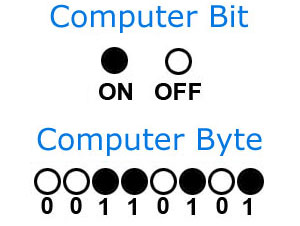
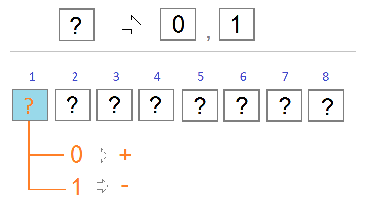

##Explanation why integer types have different size

As it was mentioned above each type in java has its size. The smallest size value for any programming language is a bit.
Bit is a binary digit. It's the smallest unit in computer memory that can have 2 states: 0 and 1 (this is why it is called
binary). So that simply means that everything in computer is just a combination of zeros and ones. But frankly speaking,
when someone wants to work with huge amount of data, like with videos or video games etc., nobody uses bites to determine
size of something, you are more likely to work with mega/giga/tera - bytes. So we use bytes (with different prefixes) to
describe amount of memory that is required for something.

And as you can see from picture above each byte consists of 8 bites. As this kind of storing data in computer memory is
the most widely spread, it is used in programming. Another important thing here to mention is that this representation of
storage is just a binary numeric system, using which we can easily determine maximum and minimum value for each data type.  
The smallest numeric data type in java is  _byte_, which means that it contains 8 bits:

    0 0 0 0 0 0 0 0//eight zeroes is minimum value, which equals to "0" in decimal system

The example above demonstrates minimal value for a byte. Respectively you may think that max value for a byte will be:

    1 1 1 1 1 1 1 1 

Which is true for binary number, which consists of 8 figures and equals to 2^8 = 255. But java has a bit different logics:
programmers are also interested in working with negative numbers, and the decision is as simple as:

Java is using 1 figure for storing negative/positive sign. If the last bit is 0 -> value is positive, otherwise it's
negative. This all leads us to the point where maximum value is actually (2^7) - 1 = 127:

    0 1 1 1 1 1 1 1 //2^7 - 1 = 127

//If you want to know how to convert binary to decimal, you can surf the internet to find the answer.  
As it is mentioned above maximum value here is 127, whereas the minimum one is -128. Byte range is from -128 up to 127.
Each data type has its size in bytes, which leads us to the point of determining maximum and minimum values for them:

1) Byte: from -2^7 to 2^7 -1
2) Short: from -2^15 to 2^15 -1
3) Int: from -2^31 to 2^31 -1
4) Long: from -2^63 to 2^63 -1

Double and float have a bit different way of managing the data. It will be described in next advanced chapters.
