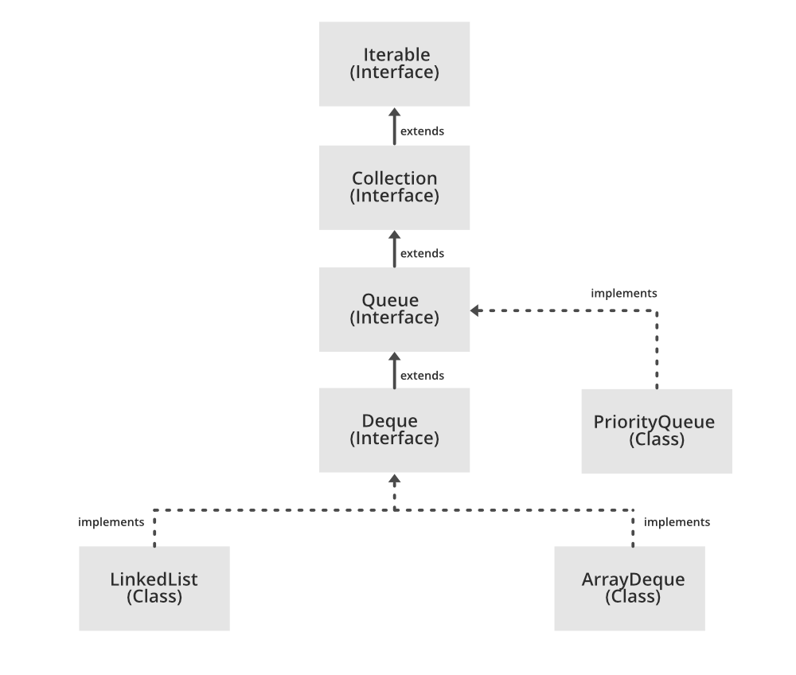

# Queue Interface (_java.util.Queue_)

## Agenda
* Hierarchy. Queue.
  * PriorityQueue
* Deque
  * LinkedList
  * ArrayDeque
* Materials


## Hierarchy. Queue.


The Java **Queue** interface, _java.util.Queue_ represents a data structure designed to have elements inserted at the end of the queue, and elements removed from the beginning of the queue. It follows the FIFO or the First-In-First-Out principle.
(**FIFO** - First In, First out)
```
public interface Queue<E> extends Collection<E>  
```

 Method                    | Second Description
---------------------------| ----------------------------------------------------------------------------------------------
 ``boolean add(object)``   | Inserts the specified element into this queue and returns true upon success
 ``boolean offer(object)`` | Insert the specified element into this queue
 ``Object remove()``       | Retrieves and removes the head of this queue
 ``Object poll()``         | Retrieves and removes the head of this queue, or returns null if this queue is empty
 ``Object element()``      | Retrieves, but does not remove, the head of this queue
 ``Object peek()``         | Retrieves, but does not remove, the head of this queue, or returns null if this queue is empty

## PriorityQueue
Java **PriorityQueue** class is a queue data structure implementation in which objects are processed based on their **priority**. It is different from standard queues where FIFO (First-In-First-Out) algorithm is followed.
By default, the priority is determined by objects’ natural ordering. Default priority can be overridden by a _Comparator_ provided at queue construction time.

```
    Queue<String> queue = new PriorityQueue<String>();
        queue.add("Aleh");
        queue.add("Valery");
        queue.add("Kristina");
        queue.add("John");
        queue.add("Ralph");
        System.out.println("head:" + queue.element());
        System.out.println("head:" + queue.peek());
        System.out.println("iterating the queue elements:");
        Iterator itr = queue.iterator();
        while (itr.hasNext()) {
            System.out.println(itr.next());
        }
        queue.remove();
        queue.poll();
        System.out.println("after removing two elements:");
        Iterator<String> itr2 = queue.iterator();
        while (itr2.hasNext()) {
            System.out.println(itr2.next());
        }
        
    Output:
        head:Aleh
        head:Aleh
        iterating the queue elements:
        Aleh
        John
        Kristina
        Valery
        Ralph
        after removing two elements:
        Kristina
        Ralph
        Valery
```

### Features
* **PriorityQueue** is an unbounded queue and grows dynamically. The default initial capacity is **11** which can be overridden using **initialCapacity** parameter in appropriate constructor.
* It does not allow ``NULL`` objects.
* Objects added to **PriorityQueue** MUST be comparable.
* The objects of the priority queue are **ordered by default in natural order**
* A ``Comparator`` can be used for custom ordering of objects in the queue.
* The **head** of the priority queue is the **least** element based on the natural ordering or comparator based ordering. When we poll the queue, it returns the head object from the queue.
* If multiple objects are present of same priority - it can poll any one of them randomly.
* **PriorityQueue** is not thread safe. Use **PriorityBlockingQueue** in concurrent environment.
* It provides ``O(log(n))`` time for add and poll methods.


## Deque
The **Deque** interface present in _java.util_ package is a subtype of the **Queue** interface. The **Deque** is related to the _double-ended_ queue that supports addition or removal of elements from either end of the data structure. **Deque** is the acronym for _Double Ended Queue_.

The Java **Deque** interface extends the Java Queue interface. That means that you can use all the Java **Queue** methods when working with a **Deque**.

Since Java **Deque** is an interface you need to instantiate a concrete implementation of the interface in order to use it:
* java.util.LinkedList
* java.util.ArrayDeque

### Features
* **Deque** interface supports resizable arrays that can grow as required
* Array dequeue _do not allow the use of ``NULL`` values_
* **Deque** does not support concurrent access by more than one thread
* **Deque** _is not thread-safe_ unless an external synchronization is provided

## LinkedList
The **LinkedList** class is a pretty standard **Deque** and **Queue** implementation. It uses a linked list internally to model a _queue_ or a _deque_.

It is a linear data structure where the elements are not stored in contiguous locations and every element is a separate object with a data part and address part. The elements are linked using pointers and addresses. Each element is known as a node. Due to the dynamicity and ease of insertions and deletions, they are preferred over the arrays or queues.

```
         Deque<String> linkedListDeque = new LinkedList<String>();
  
         // Add at the last
        linkedListDeque.add("Element 1 (Tail)");
        // Add at the first
        linkedListDeque.addFirst("Element 2 (Head)");
        // Add at the last
        linkedListDeque.addLast("Element 3 (Tail)");
        // Add at the first
        linkedListDeque.push("Element 4 (Head)");
        // Add at the last
        linkedListDeque.offer("Element 5 (Tail)");
        // Add at the first
        linkedListDeque.offerFirst("Element 6 (Head)");
        System.out.println(linkedListDeque + "\n");
  
        // Remove the first element or the last element.
        linkedListDeque.removeFirst();
        linkedListDeque.removeLast();
        System.out.println("Deque after removing "
                           + "first and last: "
                           + linkedListDeque);
                           
        Output:
        [Element 6 (Head), Element 4 (Head), Element 2 (Head), Element 1 (Tail), Element 3 (Tail), Element 5 (Tail)]
        Deque after removing first and last: [Element 4 (Head), Element 2 (Head), Element 1 (Tail), Element 3 (Tail)]                   
```

## ArrayDeque
**ArrayDeque** belongs to _java.util_ package. It implements both **Queue** and **Deque** interfaces. Internally, the **ArrayDeque** class makes use of a dynamically resizable array that grows as the number of elements is increased.

```
    Deque<String> arrayDeque=new ArrayDeque<String>();  
    arrayDeque.offer("Aleh");  
    arrayDeque.offer("Valery");  
    arrayDeque.add("Misha");  
    arrayDeque.offerFirst("John");  
    System.out.println("After offerFirst Traversal...");  
    for(String s:arrayDeque){  
        System.out.println(s);  
    }  
    arrayDeque.pollLast();  
    System.out.println("After pollLast() Traversal...");  
    for(String s:arrayDeque){  
        System.out.println(s);  
    }  
    
    Output:
    After offerFirst Traversal...
    John
    Aleh
    Valery
    Misha
    After pollLast() Traversal...
    John
    Aleh
    Valery
```
## Materials

Java , Head First book

Thinking in Java, Eckel book

https://docs.oracle.com/javase/8/docs/api/java/util/Queue.html

https://docs.oracle.com/javase/8/docs/api/java/util/Deque.html